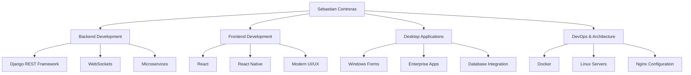

# 🚀 ¡Hola! Soy Sebastian Contreras

---

## 🗿 Sobre mí

### 💻 **Full Stack Developer Mid-Level**

Especializado en crear aplicaciones robustas tanto para web como escritorio. Tengo amplio dominio de **Django REST Framework** para desarrollo de APIs backend eficientes y **Windows Forms** para aplicaciones de escritorio empresariales.

---

## 🔥 Fortalezas Principales

<table>
<tr>
<td width="50%">

### 🌐 Backend & APIs
- **Django REST Framework**: Servicios web escalables
- **Autenticación & Serialización**: Middleware personalizado
- **Microservicios**: Docker, Nginx, orquestación
- **WebSockets**: Comunicación en tiempo real

</td>
<td width="50%">

### 🖥️ Frontend & Desktop
- **Windows Forms**: Aplicaciones empresariales
- **React**: Interfaces modernas y responsivas
- **React Native**: Desarrollo móvil multiplataforma
- **UI/UX**: Interfaces intuitivas y funcionales

</td>
</tr>
</table>

---

## 🛠️ Stack Tecnológico

### 💾 **Bases de Datos**

### 🔧 **Backend**

### 🎨 **Frontend**

### 🚀 **DevOps & Tools**

## 🎯 Especialidades

---

## 📫 ¡Conectemos!

---

**¡Gracias por visitar mi perfil!** 🚀

